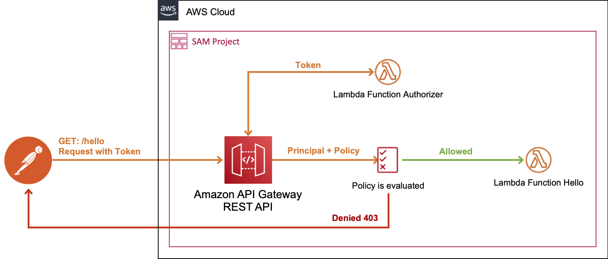

# SAM - API Gateway REST API with Lambda Authorizer

# Testing the API with the custom TOKEN authorizer

Open **[Postman](https://www.postman.com/downloads/)**, choose the **GET** method, and paste the API's Invoke URL into the adjacent URL field.

Add the Lambda `Authorization` token header and set the value to `allow`. **Choose Send**.

# References

* [SAM - Lambda TOKEN authorizer example (AWS::Serverless::Api)](https://docs.aws.amazon.com/serverless-application-model/latest/developerguide/serverless-controlling-access-to-apis-lambda-authorizer.html#serverless-controlling-access-to-apis-lambda-token-authorizer).
* [Create an API Gateway Lambda authorizer function in the Lambda console](https://docs.aws.amazon.com/apigateway/latest/developerguide/apigateway-use-lambda-authorizer.html#api-gateway-lambda-authorizer-lambda-function-create).
* [Call an API with API Gateway Lambda authorizers](https://docs.aws.amazon.com/apigateway/latest/developerguide/call-api-with-api-gateway-lambda-authorization.html)

